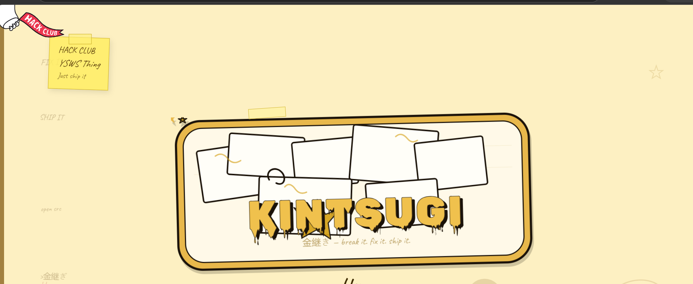

# Kintsugi
It is a hack club YSWS in which you fix broken technical thing that feels annoying to you by shiiping your project which shows the fix.Track you hours and on the basis of that get cool KINTSUGI related stuff.
 

 
 

 ##About:
 It is from a japanese concept kintsugi meaning fixing broken things with gold and with its reference i created it as a YSWS concept. 
 My tech stack-
 HTML
 CSS
 TINY JS
 SOME SVG CRAFTINGS
 
 MY goal-
 To get a sponsor for this YSWS
 Craft it even good.
 MAKE MORE LIKE THIS

 NOTE-
 IT CAN BE BUGGY IN ANDROID BUT WORK FINE IN DESKTOP
 I USED AI FOR SVG CRAFTINGS  AND IN DEPTH CSS AS I WAS A BEGGINER IN THAT AND MY ART SUCKS.YOU CAN TAKE IT AS 20 TO 30%.
 IT IS NOT COMPLETE BUT STILL 75% OF IT IS DONE.
 
 THEMED-
 I used pot svgs 
 I used Note svgs
 I used a japanese way to give it a good theme
